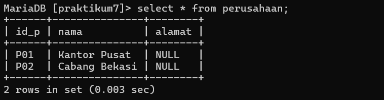
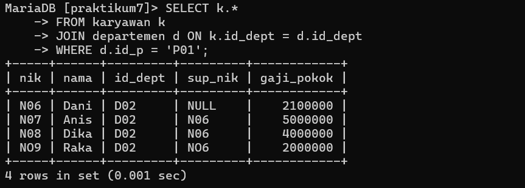

# Praktikum8
```
NIM     : 312310576
NAMA    : TAUFIK HIDAYAT
KELAS   : TI.23.A6
MATKUL  : BASIS DATA
```


# Sub Query
## Latihan


### ERD


## TABEL DAN INPUT DATA

### TABEL KARYAWAN


### TABEL DEPARTEMEN


### TABEL PERUSAHAAN


### TABEL PROJECT


### TABEL PROJECT_DETAIL


### MENGIDENTIFIKASI QUERY

Berikut adalah contoh query SQL NYA:


-- Tampilkan data karyawan yang bekerja pada departemen yang sama dengan karyawan yang bernama Dika
```sql
SELECT k1.*
FROM karyawan k1
JOIN karyawan k2 ON k1.id_dept = k2.id_dept
WHERE k2.nama = 'Dika';
```

output :


-- Tampilkan data karyawan yang gajinya lebih besar dari rata-rata gaji semua karyawan. Urutkan menurun berdasarkan besaran gaji.
```sql
SELECT *
FROM karyawan
WHERE gaji_pokok > (SELECT AVG(gaji_pokok) FROM karyawan)
ORDER BY gaji_pokok DESC;
```

output :


-- Tampilkan nik dan nama karyawan untuk semua karyawan yang bekerja di departemen yang sama dengan karyawan dengan nama yang mengandung huruf 'K'.
```sql
SELECT k.nik, k.nama
FROM karyawan k
JOIN departemen d ON k.id_dept = d.id_dept
WHERE d.id_dept IN ( SELECT id_dept FROM karyawan WHERE nama LIKE '%K%' );
```

output :


-- Tampilkan data karyawan yang bekerja pada departemen yang ada di kantor pusat.
```sql
SELECT k.*
FROM karyawan k
JOIN departemen d ON k.id_dept = d.id_dept
WHERE d.id_p = 'P01';
```

output :





-- Tampilkan nik dan nama karyawan untuk semua karyawan yang bekerja di departemen yang sama dengan karyawan dengan nama yang mengandung huruf 'K' dan gajinya lebih besar dari rata-rata gaji semua karyawan.
```sql
SELECT nik, nama
FROM karyawan 
WHERE nama = 'Dika';
```


output :


Pastikan untuk menyesuaikan nama tabel dan kolom dengan struktur tabel yang sebenarnya dalam database Anda.
